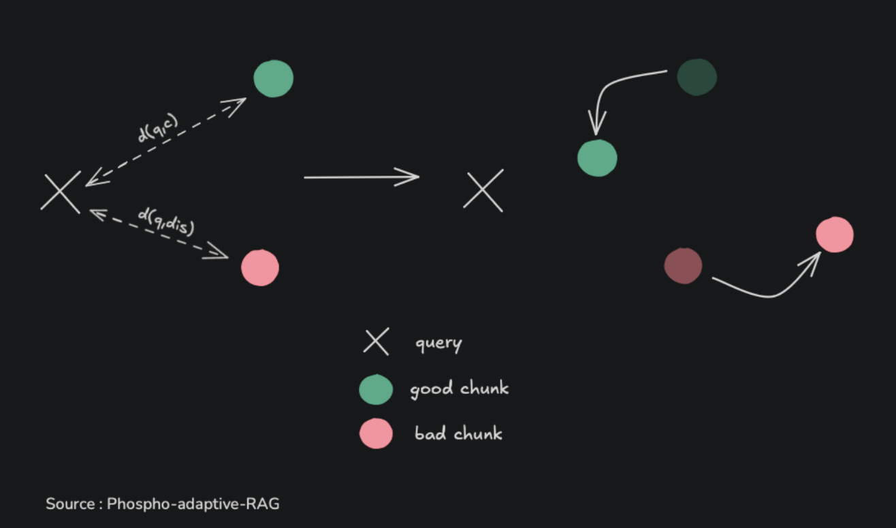
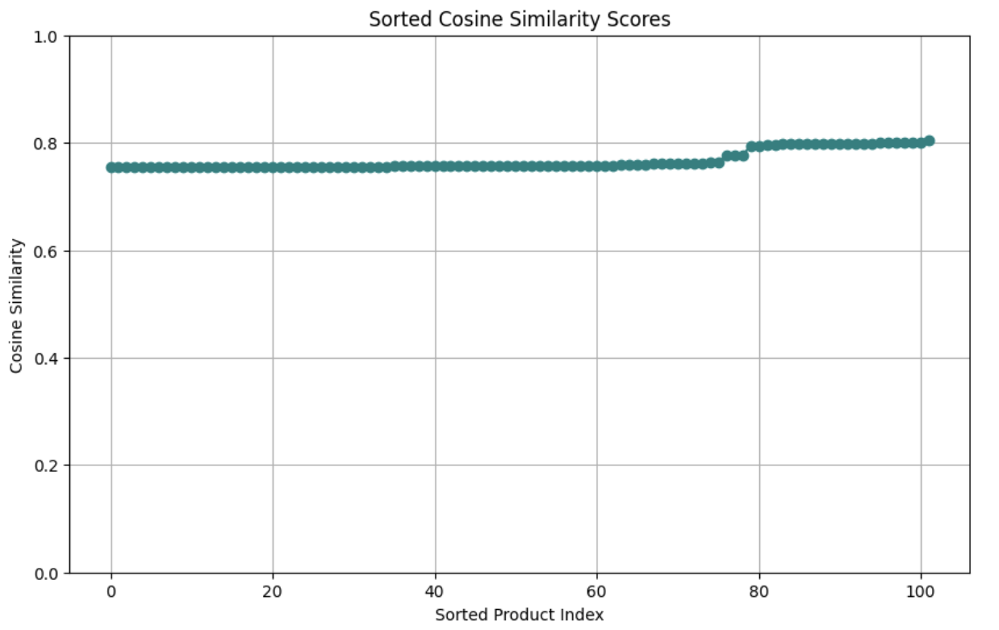
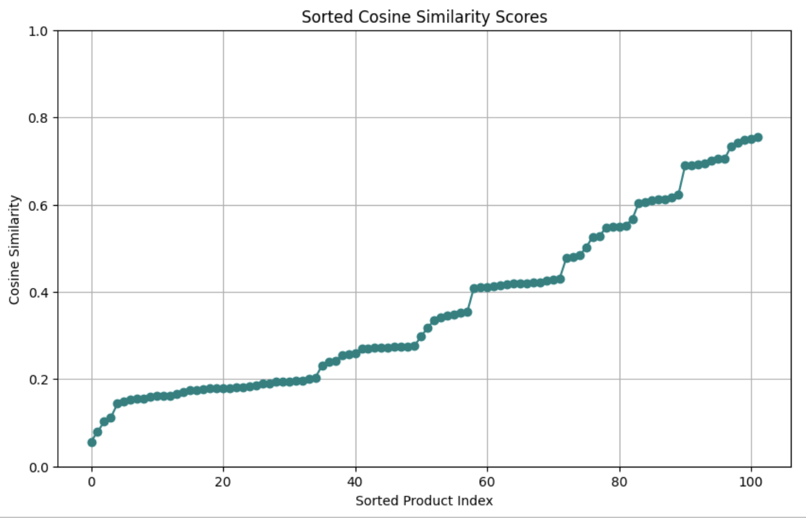

## 🎯 Triplet Loss Training

To train the linear transformation matrix `T`, we use **triplet loss**. This loss function ensures that for each query:

- The correct chunk (positive) is **closer** than
- The distractor chunk (negative), by at least a margin.

## 📷 Visualization on simple query Looking for a nice t-shirt

- Using the default ada-002 embedding model:

- After apllying the linear transformation:

